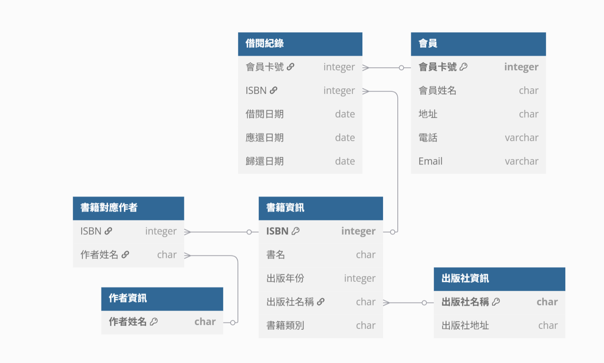

# 1.圖書館資料庫設計

## 識別問題與函數相依性

### 資料重複：

+ **書籍：**
    + 借閱紀錄中重複出現的**ISBN**、**書名**。
    + 同一本書的出版社名稱、出版社地址、出版年份、書籍類別會重複儲存。

+ **會員：**
    + 借閱紀錄中重複出現的**會員卡號**、**會員姓名**。
    + 會員的地址、電話、Email 會重複儲存。

+ **作者：**
    + 如果同一位作者有多本書，其姓名會重複儲存。

### 插入異常：
+ 如果尚未有借閱記錄，則無法記錄會員的詳細資訊。
+ 如果一本書尚未被借閱，則無法記錄其作者。

### 更新異常：
+ 如果一本書的書名發生變化，需要在所有相關的借閱記錄中更新，容易遺漏或造成不一致。
+ 如果變更會員的名稱，需要在所有相關的借閱記錄中更新。

### 刪除異常： 
+ 若刪除某筆借閱紀錄，可能會意外刪除會員或書籍的資訊。

### 函數相依性
1. **書籍：**
    + `ISBN` -> 書名, 出版年份, 出版社名稱, 出版社地址, 書籍類別
    + `ISBN` -> 作者(多值)

2. **會員：**
    + `會員卡號`-> 會員姓名、會員地址、會員電話、會員Email

3. **借閱：**
    + `(會員卡號, ISBN, 借閱日期)` → 應還日期, 歸還日期
    + `ISBN` → 書名
    + `會員卡號` → 姓名

## 正規化設計
### 初始範例：
| 會員卡號  | 會員姓名 | 會員地址     | 會員電話         | 會員Email                                       | ISBN          | 書名      | 作者姓名     | 出版社名稱 | 出版社地址     | 出版年份 | 書籍類別 | 借閱日期       | 應還日期       | 歸還日期       |
| ----- | ---- | ------ | ---------- | ------------------------------------------- | ------------- | ------- | -------- | ----- | --------- | ---- | ---- | ---------- | ---------- | ---------- |
| M1001 | 王小明  | A市X路1號 | 0912345678 | [wang@example.com](mailto:wang@example.com) | 9781234567890 | 資料庫系統概論 | 張大明, 李小芳 | 華藝出版社 | 台北市林森南路1號 | 2020 | 資訊   | 2025-04-01 | 2025-04-15 | 2025-04-10 |
| M1002 | 陳美麗  | B市Y街2號 | 0922111222 | [mei@example.com](mailto:mei@example.com)   | 9789876543210 | 現代文學賞析  | 陳文彥      | 漢文圖書  | 台中市中美街88號 | 2018 | 文學   | 2025-04-05 | 2025-04-19 |            |

### 第一正規化 1NF：
+ **要求：**
    + 每個欄位值需為不可再分的原子值
    + 拆解多值欄位為多筆紀錄

| 會員卡號  | 會員姓名 | 會員地址     | 會員電話         | 會員Email                                       | ISBN          | 書名      | 作者姓名     | 出版社名稱 | 出版社地址     | 出版年份 | 書籍類別 | 借閱日期       | 應還日期       | 歸還日期       |
| ----- | ---- | ------ | ---------- | ------------------------------------------- | ------------- | ------- | -------- | ----- | --------- | ---- | ---- | ---------- | ---------- | ---------- |
| M1001 | 王小明  | 台北市信義區XX路 | 0912345678 | [wang@example.com](mailto:wang@example.com) | 9781234567890 | 資料庫系統概論 | 張大明 | 華藝出版社 | 台北市林森南路1號 | 2020 | 資訊   | 2025-04-01 | 2025-04-15 | 2025-04-10 |
| M1001 | 王小明  | 台北市信義區XX路 | 0912345678 | [wang@example.com](mailto:wang@example.com) | 9781234567890 | 資料庫系統概論 | 李小芳 | 華藝出版社 | 台北市林森南路1號 | 2020 | 資訊   | 2025-04-01 | 2025-04-15 | 2025-04-10 |
| M1002 | 陳美麗  | 台南市東區XX路 | 0922111222 | [mei@example.com](mailto:mei@example.com)   | 9789876543210 | 現代文學賞析  | 陳文彥      | 漢文圖書  | 台中市中美街88號 | 2018 | 文學   | 2025-04-05 | 2025-04-19 |            |

### 第二正規化 2NF：
+ **要求：**
    + 所有非主鍵欄位都應完全依賴於整個主鍵

#### 1. **會員：**
1. 會員資料
    + 主鍵：`會員卡號`

        | 會員卡號 | 會員姓名 | 地址 | 電話 | Email |
        | ------- | -------  | --- | ---- | ----- |
        | M1001 | 王小明 | 台北市信義區XX路 | 0912345678 | [wang@example.com](mailto:wang@example.com) |
        | M1002 | 陳美麗  | 台南市東區XX路 | 0922111222 | [mei@example.com](mailto:mei@example.com)   |

#### 2. **書籍：**
1. 書籍資訊
    + 主鍵：`ISBN`

        | ISBN          | 書名      | 出版年份 | 出版社名稱 | 出版社地址 | 書籍類別 |
        | ------------- | ------- | ---- | ----- | ---- | -------- |
        | 9781234567890 | 資料庫系統概論 | 2020 | 華藝出版社 | 台北市林森南路1號 | 資訊   |
        | 9789876543210 | 現代文學賞析  | 2018 | 漢文圖書  | 台中市中美街88號 | 文學   |
2. 作者資訊
    + 主鍵：`作者姓名`
        | 作者姓名 |
        | ------- |
        | 張大明  |
        | 李小芳  |
        | 陳文彥  |

3. 書籍對應作者
    + Key：`ISBN`+`作者姓名`
        | ISBN | 作者姓名 |
        | ---- | ------- |
        | 9781234567890 | 張大明  |
        | 9781234567890 | 李小芳  |
        | 9789876543210 | 陳文彥  |

#### 3. **借閱：**
1. 借閱紀錄
    + Key：`會員卡號`+`ISBN`+`借閱日期`

| 會員卡號  | ISBN          | 借閱日期       | 應還日期       | 歸還日期       |
| ----- | ------------- | ---------- | ---------- | ---------- |
| M1001 | 9781234567890 | 2025-04-01 | 2025-04-15 | 2025-04-10 |
| M1002 | 9789876543210 | 2025-04-05 | 2025-04-19 |            |

### 第三正規化 3NF：
+ **要求：**
    + 消除傳遞相依，非主鍵欄位不能依賴於非主鍵欄位
1. 出版社資訊
    + 主鍵：`出版社名稱`    
        | 出版社名稱 | 出版社地址     |
        | --------- | ------------- |
        | 華藝出版社 | 台北市林森南路1號 |
        | 漢文圖書  | 台中市中美街88號 |

2. 書籍資訊
    + 主鍵：`ISBN`
         | ISBN          | 書名      | 出版年份 | 出版社名稱 | 書籍類別 |
        | ------------- | ------- | ---- | ----- | ---- |
        | 9781234567890 | 資料庫系統概論 | 2020 | 華藝出版社 | 資訊   |
        | 9789876543210 | 現代文學賞析  | 2018 | 漢文圖書  | 文學   |

## ERD
</img>