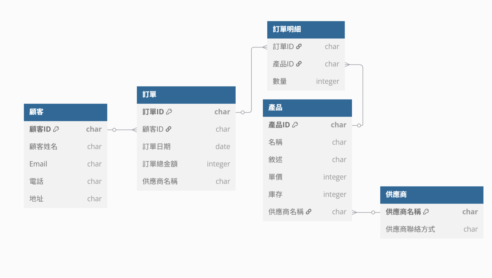

# 2.線上商店訂單系統

## 未正規化
+ **說明：**
包含多項產品資料，還有重複與巢狀資料。
    | 訂單ID  | 顧客ID | 顧客姓名 | Email                                       | 電話         | 地址       | 訂單日期       | 訂單總金額 | 產品ID | 產品名稱 | 敘述    | 單價   | 數量 | 庫存 | 供應商名稱  | 供應商聯絡方式     |
    | ----- | ---- | ---- | ------------------------------------------- | ---------- | -------- | ---------- | ----- | ---- | ---- | ----- | ---- | -- | -- | ------ | ----------- |
    | O1001 | C001 | 王小明  | [wang@example.com](mailto:wang@example.com) | 0912000123 | 台北市A路10號 | 2025-05-20 | 3200  | P001,P002 | 無線滑鼠,鍵盤 | 藍芽滑鼠,機械式鍵盤  | 800,1600  | 2,1  | 20,15 | Tech供應 | 02-12345678 |
    | O1002 | C002 | 林大頭  | [lin@example.com](mailto:lin@example.com) | 0912378456 | 台南市B路50號 | 2025-05-02 | 5000  | P003 | 喇叭   | 藍芽喇叭 | 5000 | 1  | 10 | Ear供應 | 06-11115555 |

## 函數相依性
+ `顧客ID` -> 顧客姓名, Email, 電話, 地址
+ `訂單ID` -> 顧客ID, 訂單日期, 訂單總金額
+ `產品ID` -> 產品名稱, 敘述, 單價, 庫存, 供應商名稱, 供應商聯絡方式
+ `供應商名稱` -> 供應商聯絡方式
+ `(訂單ID, 產品ID)` -> 數量

## 第一正規化 1NF
+ **要求：**
所有欄位為原子值，無重複欄與巢狀集合。
    | 訂單ID  | 顧客ID | 顧客姓名 | Email                                       | 電話         | 地址       | 訂單日期       | 訂單總金額 | 產品ID | 產品名稱 | 敘述    | 單價   | 數量 | 庫存 | 供應商名稱  | 供應商聯絡方式     |
    | ----- | ---- | ---- | ------------------------------------------- | ---------- | -------- | ---------- | ----- | ---- | ---- | ----- | ---- | -- | -- | ------ | ----------- |
    | O1001 | C001 | 王小明  | [wang@example.com](mailto:wang@example.com) | 0912000123 | 台北市A路10號 | 2025-05-20 | 3200  | P001 | 無線滑鼠 | 藍芽滑鼠  | 800 | 2 | 20,15 | Tech供應 | 02-12345678 |
    | O1001 | C001 | 王小明  | [wang@example.com](mailto:wang@example.com) | 0912000123 | 台北市A路10號 | 2025-05-20 | 3200  | P002 | 鍵盤 | 機械式鍵盤  | 1600  | 1  | 15 | Tech供應 | 02-12345678 |
    | O1002 | C002 | 林大頭  | [lin@example.com](mailto:lin@example.com) | 0912378456 | 台南市B路50號 | 2025-05-02 | 5000  | P003 | 喇叭   | 藍芽喇叭 | 5000 | 1  | 10 | Ear供應 | 06-11115555 |

## 第二正規化 2NF
+ **要求：**
移除**部分相依**，非主鍵欄位必須完全依賴整個主鍵。

1. **顧客**
    + **主鍵：**`顧客ID`
        | 顧客ID | 顧客姓名 | Email                                       | 電話         | 地址       |
        | ---- | ---- | ------------------------------------------- | ---------- | -------- |
        | C001 | 王小明  | [wang@example.com](mailto:wang@example.com) | 0912000123 | 台北市A路10號 |
        | C002 | 林大頭  | [lin@example.com](mailto:lin@example.com) | 0912378456 | 台南市B路50號 | 

2. **訂單**
    + **主鍵：**`訂單ID`
        | 訂單ID  | 顧客ID | 訂單日期       | 訂單總金額 | 供應商名稱 | 供聯絡方式 |
        | ----- | ---- | ---------- | ----- | ------ | ------- |
        | O1001 | C001 | 2025-05-20 | 3200  | Tech供應 | 02-12345678 |
        | O1002 | C002 | 2025-05-02 | 5000  | Ear供應 | 06-11115555 |

3. **產品**
    + **主鍵：**`產品ID`
        | 產品ID | 名稱   | 敘述   | 單價   | 庫存 | 供應商名稱  |
        | ---- | ---- | ---- | ---- | -- | ------ |
        | P001 | 無線滑鼠 | 藍芽滑鼠 | 800  | 20 | Tech供應 |
        | P002 | 鍵盤   | 機械鍵盤 | 1600 | 15 | Tech供應 |
        | P003 | 喇叭   | 藍芽喇叭 | 5000 | 10 | Ear供應 |

4. **訂單明細**
     + **Key：**`訂單ID`+`產品ID`
        | 訂單ID  | 產品ID | 數量 |
        | ----- | ---- | -- |
        | O1001 | P001 | 2  |
        | O1001 | P002 | 1  |
        | O1002 | P003 | 1  |

## 第三正規化 3NF
+ **要求：**
消除**傳遞相依**，非主鍵屬性不能依賴於非主鍵欄位。

1. **供應商**
     + **主鍵：**`供應商名稱`
        | 供應商名稱 | 供應商聯絡方式 |
        | --------- | ------------- |
        | Tech供應 |  02-12345678 |
        | Ear供應 | 06-11115555 | 

2. **訂單**
    + **主鍵：**`訂單ID`
        | 訂單ID  | 顧客ID | 訂單日期       | 訂單總金額 | 供應商名稱 |
        | ----- | ---- | ---------- | ----- | ------ |
        | O1001 | C001 | 2025-05-20 | 3200  | Tech供應 |
        | O1002 | C002 | 2025-05-02 | 5000  | Ear供應 |

## ERD
</img>

