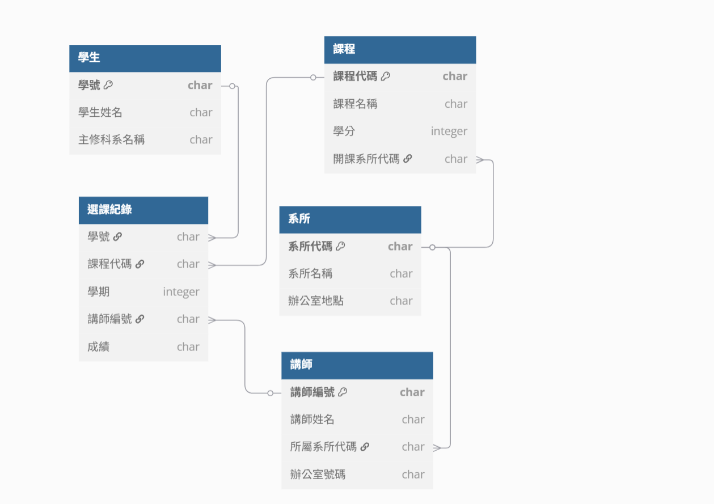

# 3.大學課程註冊系統

## 未正規化
| 學號   | 學生姓名 | 主修科系名稱 | 科系辦公室 | 課程代碼  | 課程名稱 | 學分 | 開課系所代碼 | 開課系所名稱 | 學期   | 講師編號 | 講師姓名 | 講師系所代碼 | 講師系所名稱 | 講師辦公室  | 成績 |
| ---- | ---- | ------ | ----- | ----- | ---- | -- | ------ | ------ | ---- | ---- | ---- | ------ | ------ | ------ | -- |
| S001 | 林小明  | 資訊工程學系 | 資工館3樓 | CS101 | 資料結構 | 3  | CS     | 資訊工程學系 | 1121 | T001 | 張教授  | CS     | 資訊工程學系 | 資工館402 | A  |
| S001 | 林小明  | 資訊工程學系 | 資工館3樓 | MA101 | 微積分  | 4  | MA     | 數學系    | 1121 | T002 | 李教授  | MA     | 數學系    | 數學館210 | B+ |

## 函數相依性
+ `學號` -> 學生姓名, 主修科系名稱, 主修科系辦公室地點
+ `系所代碼` -> 系所名稱
+ `課程代碼` -> 課程名稱, 學分, 開課系所代碼
+ `講師編號` -> 講師姓名, 講師所屬系所代碼, 講師辦公室號碼
+ `(學號, 課程代碼, 學期, 講師編號)` -> 成績

## 第一正規化 1NF
原始表格已無重複群組與巢狀集合（每筆記錄為原子值），已滿足 1NF。

## 第二正規化 2NF
+ **學生**
    + 主鍵：`學號`

    | 學號   | 學生姓名 | 主修科系名稱 |
    | ---- | ---- | ------ |
    | S001 | 林小明  | 資訊工程學系 |

+ **系所**
    + 主鍵：`系所代碼`

    | 系所代碼 | 系所名稱   | 辦公室地點 |
    | ---- | ------ | ----- |
    | CS   | 資訊工程學系 | 資工館3樓 |
    | MA   | 數學系    | 數學館2樓 |

+ **課程**
    + 主鍵：`課程代碼`

    | 課程代碼  | 課程名稱 | 學分 | 開課系所代碼 |
    | ----- | ---- | -- | ------ |
    | CS101 | 資料結構 | 3  | CS     |
    | MA101 | 微積分  | 4  | MA     |

+ **講師**
    + 主鍵：`講師編號`

| 講師編號 | 講師姓名 | 所屬系所代碼 | 辦公室號碼  |
| ---- | ---- | ------ | ------ |
| T001 | 張教授  | CS     | 資工館402 |
| T002 | 李教授  | MA     | 數學館210 |

+ **選課紀錄**
    + Key：`(學號, 課程代碼, 學期, 講師編號)`

    | 學號   | 課程代碼  | 學期   | 講師編號 | 成績 |
    | ---- | ----- | ---- | ---- | -- |
    | S001 | CS101 | 1121 | T001 | A  |
    | S001 | MA101 | 1121 | T002 | B+ |

## 第三正規化 3NF
+ **處理**
    + 主修科系名稱 -> 辦公室地點 ： 已放入獨立的 Department 表中
    + 講師編號 -> 講師姓名, 辦公室號碼 ： 已獨立為 Instructors 表
    + 課程代碼 -> 開課系所代碼 -> 系所名稱 ： 避免傳遞相依
+ 目前架構已滿足 3NF

## BCNF
+ **定義：**
對於每一個函數相依 A → B，其中 A 必須是超鍵（superkey）
+ **問題：**
若允許一門課同時由多位講師授課，則 (課程代碼, 學期) 不一定能唯一對應到一位講師，因此仍需 (學號, 課程代碼, 學期, 講師編號) 作為主鍵。
+ 目前架構已被完整拆分為無循環依賴，**滿足 BCNF**。

## 分析與說明
+ **挑戰：**
    + 課程與講師為多對多關係（不同班、共同授課）
    + 成績紀錄需確保與正確講師對應
+ **決策說明：**
    + 因無循環依賴與非超鍵決定主鍵，可達 BCNF
    + 若系統需高效率查詢「某課程全部學生」，Enrollment 表可能需要建複合索引

## ERD
</img>